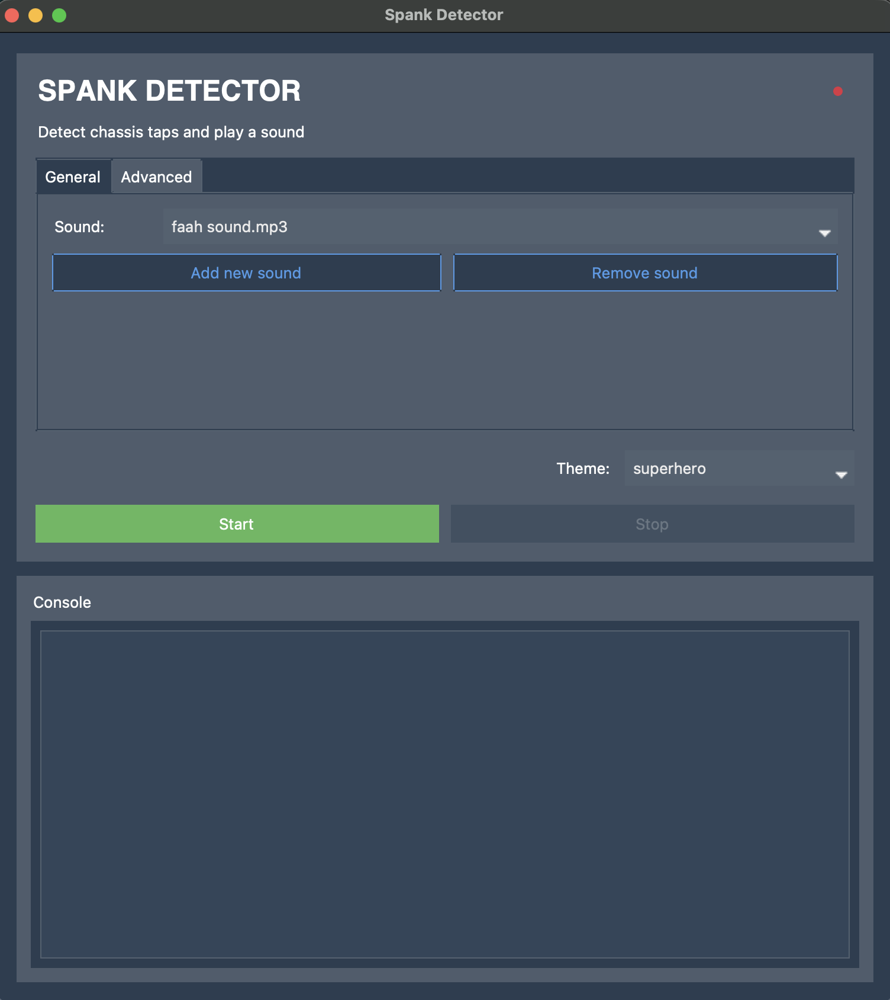
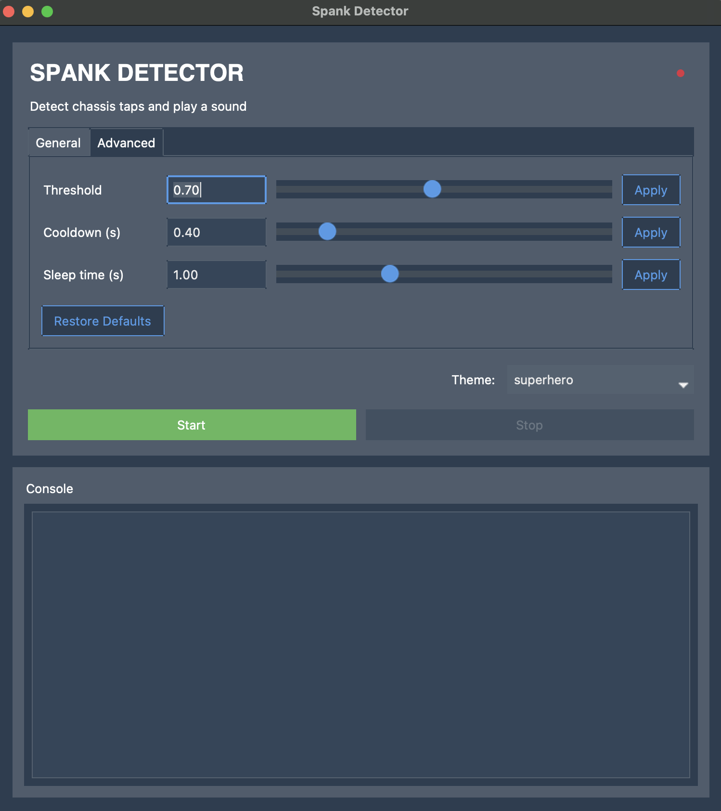
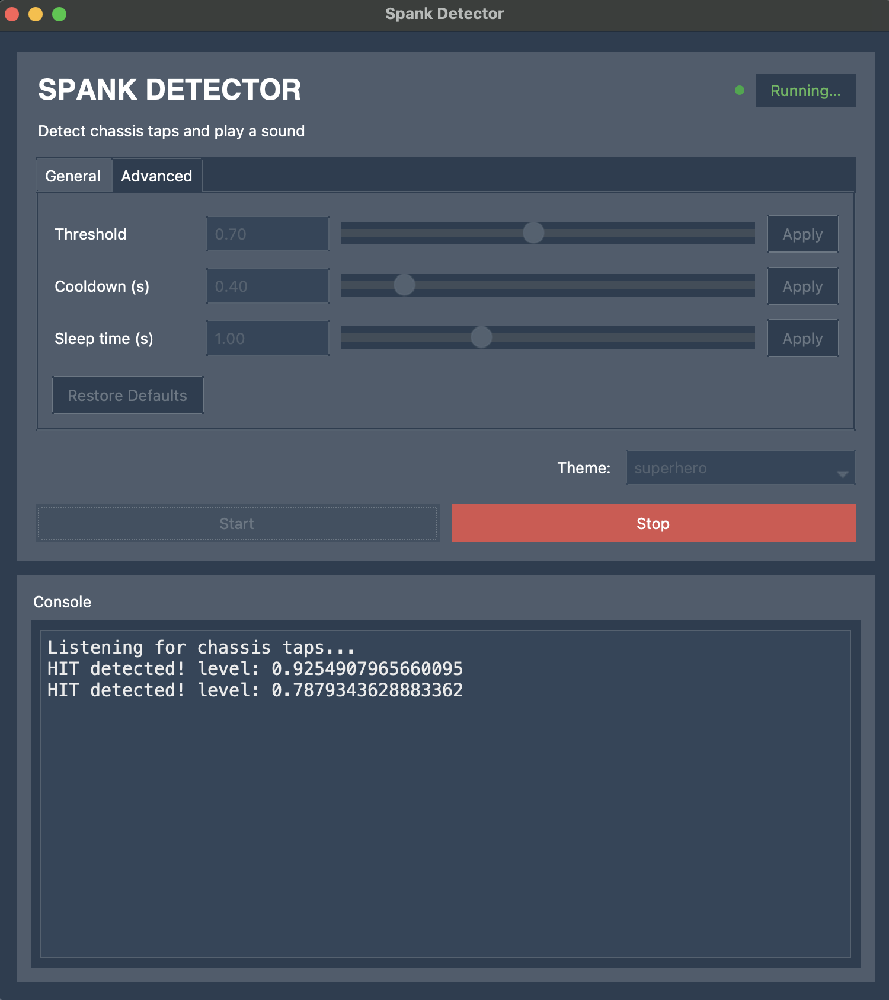

# Spank Detector

A macOS menubar-free desktop app that listens to your microphone and plays a custom sound every time it detects a chassis tap (or any sharp impact). Built with Python, ttkbootstrap, and sounddevice.

---

## Screenshots

### General Tab


### Advanced Tab


### Running — Hits Being Detected


---

## Project Structure

```
mac-spanks/
├── src/
│   ├── app.py              # Main GUI (ttkbootstrap window, all UI logic)
│   ├── detector.py         # Audio capture + hit detection thread
│   ├── config_manager.py   # Persistent config read/write (App Support)
│   └── config.json         # Bundled seed config (defaults only)
├── assets/
│   ├── faah_sound.mp3      # Default hit sound bundled into the .app
│   └── icon.icns           # App icon (optional)
├── images/
│   ├── general_tab.png
│   ├── advanced_tab.png
│   └── running_app.png
├── requirements.txt
└── build.sh                # One-command build script
```

---

## How It Works

Spank Detector continuously reads audio from your Mac's microphone using `sounddevice`. On every audio block, it computes the **peak amplitude**. If the peak exceeds your configured **threshold** — and enough time has passed since the last trigger (the **cooldown**) — it fires and plays your chosen MP3 sound.

This makes it ideal for reacting to physical chassis taps, desk knocks, or any sharp percussive sound.

---

## Features

- **Sound picker** — select any MP3 file from your machine; add or remove sounds from the list at any time
- **Threshold control** — dial in the sensitivity so only real taps trigger it, not background noise
- **Cooldown control** — minimum time (in seconds) between consecutive triggers to prevent rapid-fire
- **Sleep time control** — how long the audio thread sleeps between processing cycles (affects CPU usage)
- **Live console** — shows real-time hit log with peak levels
- **Running indicator** — green dot + "Running…" badge while active
- **Theme picker** — 20+ built-in ttkbootstrap themes (dark and light), persisted across launches
- **Persistent config** — all settings auto-saved to `~/Library/Application Support/Spank Detector/config.json`

---

## Requirements

- macOS (tested on macOS 12+)
- Python 3.10+
- [Homebrew](https://brew.sh) (for `portaudio`)

### Python dependencies

| Package | Version |
|---|---|
| `sounddevice` | 0.5.5 |
| `playsound3` | 3.3.1 |
| `numpy` | 2.4.2 |
| `PyObjC` | 12.1 |
| `ttkbootstrap` | 1.20.1 |

---

## Running from Source

```bash
# 1. Clone the repo
git clone https://github.com/yourname/mac-spanks.git
cd mac-spanks

# 2. Install portaudio via Homebrew
brew install portaudio

# 3. Create a virtual environment and install dependencies
python3 -m venv .venv
source .venv/bin/activate
pip install -r requirements.txt

# 4. Run the app
python src/app.py
```

---

## Building a Standalone .app

The repo includes a `build.sh` script that handles everything end-to-end: dependencies, venv, PyInstaller packaging, plist injection, and code signing.

### Prerequisites

- Homebrew installed
- `portaudio` installed (`brew install portaudio`)
- Python 3.10+ available as `python3`

### Run the build

```bash
chmod +x build.sh
./build.sh
```

The finished `.app` will be at:
```
dist/Spank Detector.app
```

### What `build.sh` does

| Step | Description |
|---|---|
| 0 | Sanity checks — verifies source files exist |
| 1 | Installs/updates `portaudio` via Homebrew |
| 2 | Creates a Python venv (skipped if one already exists) |
| 3 | Installs Python dependencies + PyInstaller |
| 4 | Cleans previous build artifacts |
| 5 | Runs PyInstaller in `--windowed` mode, bundling `config.json` and the default MP3 |
| 6 | Injects `NSMicrophoneUsageDescription` into the app's `Info.plist` |
| 7 | Ad-hoc code-signs the `.app` so macOS triggers the microphone permission dialog |

### First launch of the .app

On first launch, the app will:
1. Copy the bundled default `config.json` into `~/Library/Application Support/Spank Detector/`
2. Copy the bundled sample sound (`faah_sound.mp3`) to the same directory for a stable, persistent path
3. Prompt you for **microphone access** — you must allow this for detection to work

If the microphone permission dialog does not appear, check **System Settings → Privacy & Security → Microphone** and enable it manually.

### Resetting microphone permissions

To force the permission dialog to reappear for just this app:

```bash
# Get the bundle identifier
/usr/libexec/PlistBuddy -c "Print :CFBundleIdentifier" \
  "dist/Spank Detector.app/Contents/Info.plist"

# Reset only this app's mic permission
tccutil reset Microphone <bundle-id>
```

> [!WARNING]
> Running `tccutil reset Microphone` without a bundle ID resets permissions for **all apps** on your system. Always pass the specific bundle identifier.


---

## Configuration

All settings are stored at:
```
~/Library/Application Support/Spank Detector/config.json
```

Example:
```json
{
    "active_values": {
        "threshold": 0.59,
        "cooldown": 0.4,
        "sleep_time": 1.0,
        "hit_sound": "/Users/you/Library/Application Support/Spank Detector/faah_sound.mp3"
    },
    "default_values": {
        "threshold": 0.7,
        "cooldown": 0.4,
        "sleep_time": 1.0,
        "hit_sound_list": [
            "/Users/you/Library/Application Support/Spank Detector/faah_sound.mp3"
        ]
    },
    "ui": {
        "theme": "darkly"
    }
}
```

### Parameter reference

| Parameter | Default | Description |
|---|---|---|
| `threshold` | `0.7` | Peak amplitude (0.0–1.5) required to trigger a hit. Lower = more sensitive. |
| `cooldown` | `0.4` | Minimum seconds between consecutive triggers. Prevents rapid-fire. |
| `sleep_time` | `1.0` | Seconds the audio thread sleeps between processing cycles. Higher = less CPU. |
| `hit_sound` | *(bundled)* | Absolute path to the MP3 played on each hit. |

---

## Available Themes

The theme picker in the UI exposes all ttkbootstrap themes. Some highlights:

**Dark:** `darkly` (default), `cyborg`, `superhero`, `solar`, `vapor`

**Light:** `flatly`, `cosmo`, `minty`, `litera`, `journal`, `sandstone`, `yeti`

The selected theme is persisted to `config.json` and restored on next launch.

---

## License

GNU General Public License v2.0 — see [LICENSE](LICENSE) for details.
